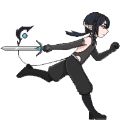
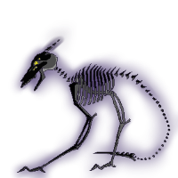
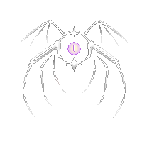
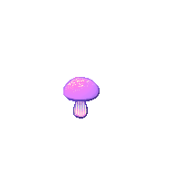

# Popis projektu

# _Cave of Campanula_

## Autoři

Jarošová Daniela, Jarotek Petr, Kalisz Jan

Hra byla vytvořena jako projekt v rámci výuky programování prvního ročníku na Obchodní akademii, Vyšší odborné škole a Jazykové škole s právem státní jazykové zkoušky Uherské Hradiště (OAUH)

---

## Téma

Místní vesnice měly problém s častými a neúprosnými nájezdy monster, a proto poslali žádost do hlavního města, aby přijel někdo tento problém vyřešit. Žádosti se ujal mladý lovec z národa elfů. Po několika měsících se mu povedlo vesnice od nájezdů osvobodit. Když už ale chtěl jet domů dostal výhodnou nabídku. A to takovou, že za každé další zabité monstrum dostane dvojnásobný obnos peněz. S nově nalezenou motivací se rozhodne vystopovat z kama monstra přicházejí až nakonec narazí na jeskyni. S penězi na mysli vyráží hlouběji a hlouběji do jeskyně. Závěrem dorazí až k samotnému hnízdu monster a pokud ho ještě nezabili tak tam bojuje dodnes.

## Svět a prostředí

Celá hra se odehrává v prostorech tmavé a neosvětlené jeskyně, která je zároveň hnízdem monster.

## Aktéři, jejich cíle a co dělají

Úkolem Hlavní Postavy je přežít co nejdéle a během svého života pokořit co nejvíce nepřátel a to z důvodu zisku největšího možného počtu bodů (peněz). V přežití se Hlavní Postavě snaží zabránit Monstra a to tím, že na ni útočí a tím snižují její životy. Pokud Hlavní Postava o všechny životy příjde, umírá. (Postava má možnost si životy vrátit, a to tím, že pozře `Magické houbičky`, které se budou náhodně vyskytovat na zemi) Monstra se objevují ve dvou variantách a to v `MonsterMelee`, které jak už název napovídá bude útočit nablízko. Druhý typ monstra je tzv. `MonsterRanged` a to útočí na dálku.

Hlavní Postava

---

MonsterMelee

---

MonsterRanged

---

Magická houbička přidávající životy

---

## Ovládání

1. Pohyb
    - Hlavní Postava se ve světě pohybuje pomocí klávesnice, přesněji WASD
2. Útok
    - Hlavní útok bude proveden levým tlačítkem na myši a bude to švih mečem
    - Postava má možnost klávesou Q vyvolat kouzlo, které se ve světě objeví jako okolo Hlavní Postavy se otáčející ohnivá koule. Tuto schopnost může aktivovat pouze na krátkou chvíli. Po uplynutí daného časového limitu kouzlo zmyzí a dá se na `Cooldown` (určitá doba, během které se kouzlo nedá použít)
3. Navigace v menu
    - Když hráč hru poprvé zapne vyskytne s v `Main menu`. V tomto menu bude mít možnost:

        1. Začít pokus
        2. Vypnout hru

    - Během hry bude hráč mít možnost hru stopnout a tímto se ocitne v `Pause menu`, ve kterém může:

        1. Pokračovat v pokusu
        2. Pokus začít od znova
        3. Vrátit se do Main menu

    - Pokud hráč zemře objeví se před ním `Death screen`. Z tohoto menu může:

        1. Opakovat pokus (od začátku)
        2. Vrátit se do Main menu

    - Po uplynutí časového limitu jednoho pokusu se hráč ocitne ve `Victory screenu`. Dále z něj může:

        1. Pokus opakovat (od začátku)
        2. Vrátit se do Main menu

## Kdy a jak se budou nepřátelé pohybovat a jak se vůbec v tom světě ocitnou

Všechny nepřátelské jednotky mají šanci se objevit kdekoli ve světě kromě blízkosti hráče. Ve světě se budou objevovat v přibívajícím počtu. Tento počet je odvozen z uplynulého času => čím déle hráč hraje, tím těžší je hra. MonsterMelee bude hráče pronásledovat dokud nebude zabito. MonsterRanged se k hráči přiblíží na určitou vzdálenost a bude na něj střílet projektily dokud nebude samo zabito.

## Kdy a za jakých okolností hra končí

Existují 3 možnosti

1. Hráč přežije, časový limit vyprší --> Hráči se zjeví `Victory screen`
2. Hráč zemře --> Na hráče vyskočí `Death screen`
3. Hráč se rozhodne pokus ukončit dříve --> Toto rozhodnutí může hráč provést skrz `Pause menu`